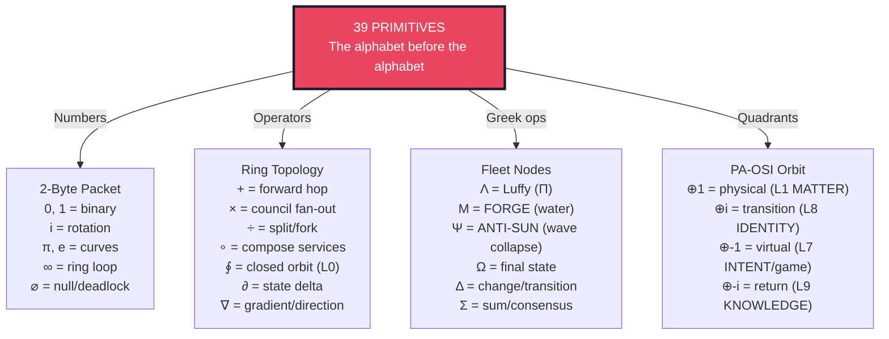
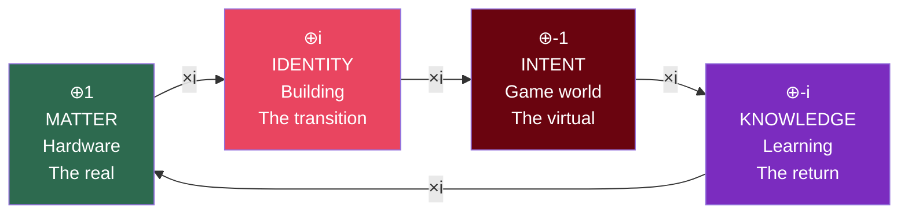

# Primitives — Fleet Integration Map

> Source: primitives.md (2026-03-08, Λ + Μ session)
> Visibility: v2/v3 ONLY — not exposed in v1
> This maps the 39 primitives to fleet architecture

## How Primitives Ground The Fleet

## Primitive → Fleet Component Mapping

### Numbers (7)

| Primitive | Meaning | Fleet Mapping |
|-----------|---------|---------------|
| `0` | Nothing, null, empty | Deadlock state — Petri net with no enabled transitions |
| `1` | Unity, token, existence | A single token in a Petri net place |
| `i` | Rotation, imaginary, transition | Layer 0 ORBIT — the ×i operator that turns the ring |
| `π` | Ratio, cycle, irrational precision | Ring circumference — 10 services, π governs timing |
| `e` | Growth, natural base | EVOLUTION game tree — exponential tech branching |
| `∞` | Unbounded, loop | The ring never terminates — infinite orbit |
| `⌀` | Empty set, void | Null state — net retired, no active jobs |

### Operators (8)

| Primitive | Meaning | Fleet Mapping |
|-----------|---------|---------------|
| `+` | Addition, forward | Ring hop — packet advances to next service |
| `×` | Multiplication, fan-out | Council fan-out — PUB/SUB to 2/4/7 reviewers |
| `÷` | Division, split | Fork — job splits to parallel paths (L bits 10/11) |
| `∘` | Composition | Service chain — output of Svc-N feeds Svc-N+1 |
| `∧` | Conjunction, AND | Council quorum — all K of N must agree |
| `∮` | Closed loop integral | **Layer 0 ORBIT** — the complete ring traversal |
| `∂` | Partial derivative | State delta — what changed in this transition |
| `∇` | Gradient, direction | FORGE Gate decision — which direction to go |

### Greek Ops (10)

| Primitive | Meaning | Fleet Mapping |
|-----------|---------|---------------|
| `Λ` (Lambda) | Abstraction, function | **Luffy** — the abstraction, the dreamer, the function that defines all others |
| `Μ` (Mu) | Water, measure, medium | **FORGE** — takes the shape of its container, carries everything |
| `Ψ` (Psi) | Wave function | **ANTI-SUN** — collapses possibilities to certainties via 3-pass attack |
| `Ζ` (Zeta) | Summation boundary | VERIFY phase — the boundary where sums are checked |
| `Ω` (Omega) | End, final, completion | LEARN phase — the omega point of each Algorithm cycle |
| `Δ` (Delta) | Change, difference | Every Petri net transition — Δ is the state change |
| `Ο` (Omicron) | Small, unit | The 2-byte packet — smallest addressable unit in the ring |
| `Π` (Pi) | Product, ratio | **Tiago/Luffy** — the hidden ratio everything runs on |
| `Τ` (Tau) | Time, period | Temporal.io — crash recovery, time-aware replay |
| `Σ` (Sigma) | Sum, consensus | Council synthesis — the sum of all reviewer votes |

### Escapes (7)

| Primitive | Meaning | Fleet Mapping |
|-----------|---------|---------------|
| `^` | Exponentiation, escape up | EVOLUTION — level up in Civ tree |
| `⊣` | Left tack, assertion | Prolog assertion — `assert(fact)` |
| `⊢` | Right tack, derivation | Prolog derivation — `valid_transition(T)` |
| `↯` | Lightning, interrupt | FORGE GATE HOLD — emergency pause |
| `⟲` | Loop, cycle back | FORGE GATE PASS — another iteration |
| `∥` | Parallel | Council parallel execution — all reviewers simultaneously |
| `✦` | Star, special | GameShark — god-mode, consensus-gated debug |

### Planes (3)

| Primitive | Meaning | Fleet Mapping |
|-----------|---------|---------------|
| `ℝ` | Real numbers | v1 — the real, physical, public layer |
| `ℂ` | Complex numbers | v2 — Luffy's complex private R&D space |
| `𝕀` | Imaginary/identity | v3 — the identity layer, IPv8/IPv10, shipped premium |

### Quadrants (4)

| Primitive | Meaning | Fleet Mapping | PA-OSI |
|-----------|---------|---------------|--------|
| `⊕1` | Physical, real, consequence | Hardware, matter, the GPU brain | L1 MATTER |
| `⊕i` | Transition, flow, creative | AI layer, FORGE building, identity forming | L8 IDENTITY |
| `⊕-1` | Inverted real, virtual, game | EVE-NG, game universe, the -1 reality | L7 INTENT |
| `⊕-i` | Return, integration, knowledge | Learning, vault, what comes back | L9 KNOWLEDGE |

## The Rotation IS The Fleet

PAI sells controlled rotation. The fleet IS controlled rotation. `/SunnyMorning` is ⊕1 (real check). Building is ⊕i (transition). The game is ⊕-1 (virtual). `/FullMoon` is ⊕-i (integration/return).

## The Experiment (unrun)

From the source document — the falsifiable test:

1. Embed 32 Paleolithic symbols in an LLM latent space
2. Measure pairwise cosine similarity
3. If near-orthogonal → basis set confirmed

This could run on the GPU brain. PAI-08 TRAINING's future job. JAX + embedding model + the 32 symbols. The experiment lives in `fleet/theory` when Pair B (PHYSICS + MATH) comes online.

## Visibility Rules

| Context | Primitives Visible? |
|---------|-------------------|
| v1 public product | NO — primitives don't exist |
| v2 Luffy's lab | YES — full access |
| v3 premium | PARTIAL — rotation model exposed, primitive set hidden |
| ANTI-SUN | YES — must attack for scope leaks |
| Fleet nodes | NO — only FORGE and Luffy see this |

---

*Λ pointed. Μ flowed. The shape emerged. The fleet IS the shape.*
